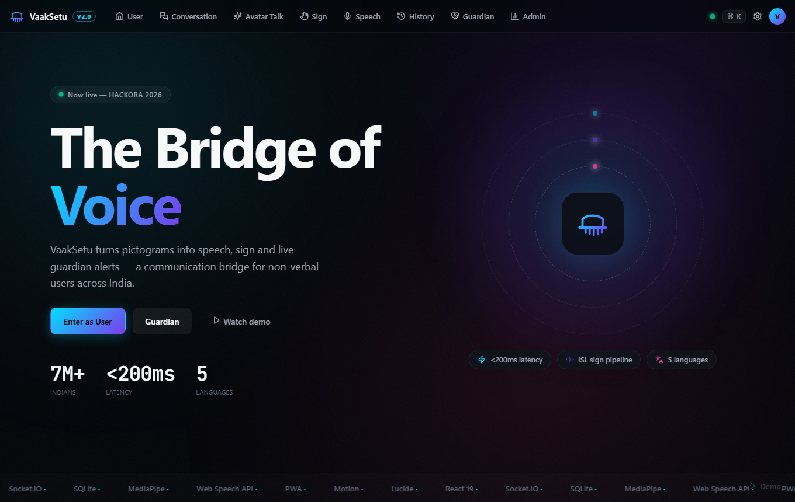
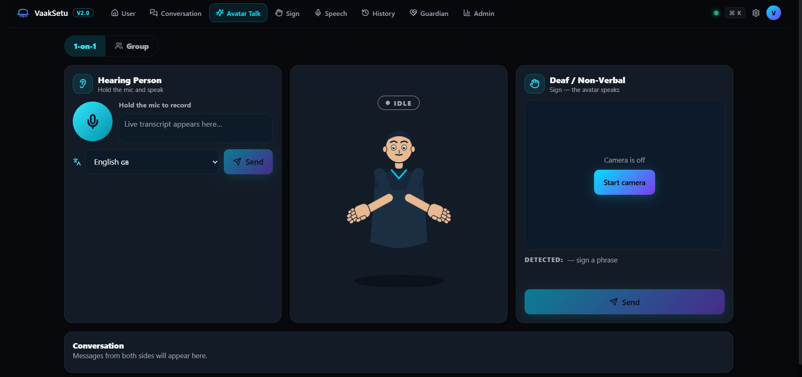
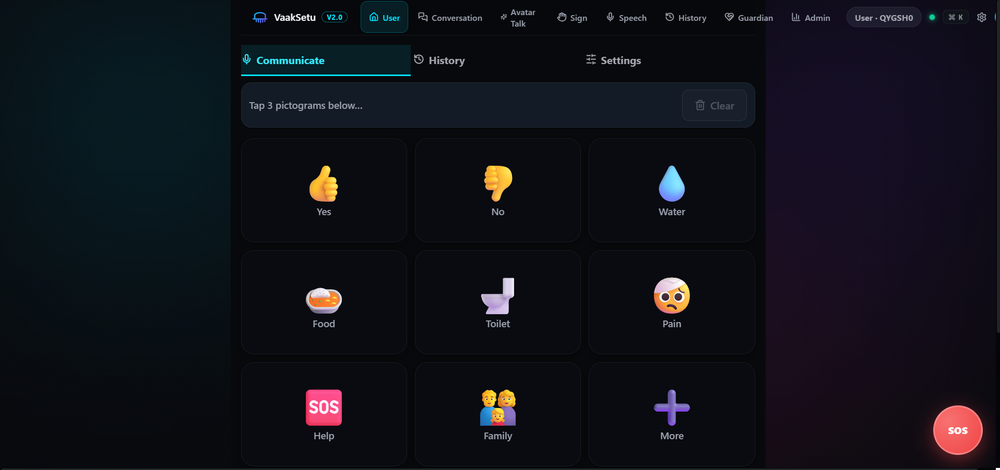
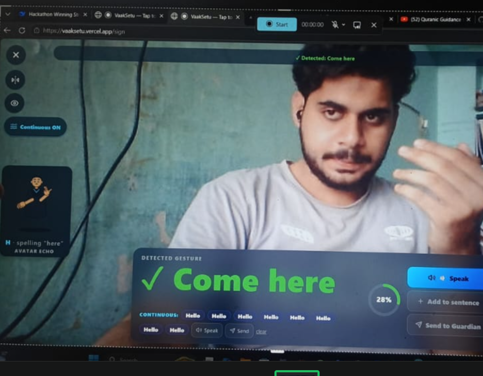
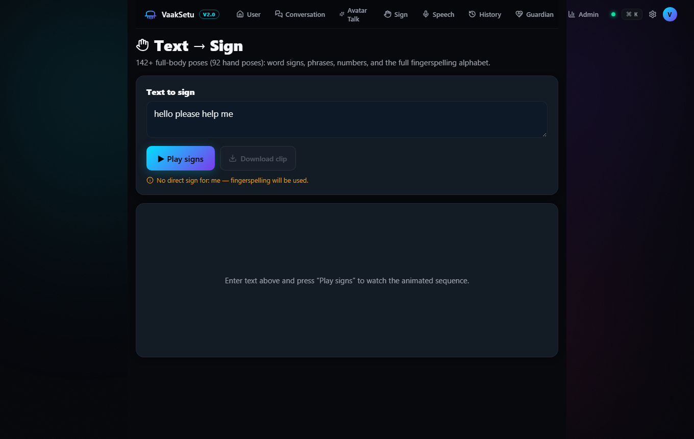
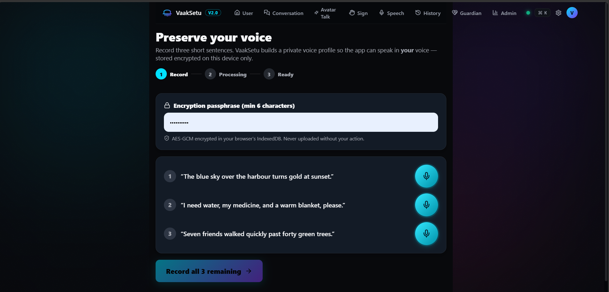

# VaakSetu 🎭

### The Bridge of Voice — An AI-powered AAC platform for non-verbal users

[Live Demo](https://vaaksetu.vercel.app) · [Backend API](https://vaaksetu-api-cit0.onrender.com/api/health) · [Report Bug](https://github.com/infoknahmed/vaaksetu-2026/issues) · [Request Feature](https://github.com/infoknahmed/vaaksetu-2026/issues)

---

## 🌟 What is VaakSetu?

Over **7 million Indians** live with speech and language impairments — cerebral palsy,
ALS, stroke recovery, non-verbal autism, locked-in syndrome. For most of them, the
only way to "speak" is a dedicated AAC device that costs **₹5,00,000+** and is
out of reach for the vast majority of families. Communication — the most basic
human right — becomes a privilege of wealth.

**VaakSetu** (Sanskrit: *voice bridge*) is a free, web-based alternative that turns
any ₹10,000 smartphone or laptop into a full communication system. It works in both
directions: spoken words become animated sign language on screen, and hand signs
become spoken words through the device. Everything that can run on-device **does**
run on-device — the AI models, the sign recognition, even the user's cloned voice —
so it keeps working offline and never uploads sensitive voice or video data.

The result is not a chat app with buttons bolted on. It's a living interpreter: an
expressive 2D avatar that listens, signs, and speaks with facial emotion — built to
let a deaf person and a hearing person who shares no common language *hold a
conversation*.

## ✨ Features

### Core (HT-02 Requirements)

- 🎤 **Speech → Text** — live transcription with confidence badges and alternatives
- 🔊 **Text → Speech** — 5 Indian languages (English, हिन्दी, ಕನ್ನಡ, తెలుగు, தமிழ்)
- ✋ **Sign Language → Text/Speech** — camera-based recognition via MediaPipe Hands
- 🧑‍🏫 **Text → Sign Language** — animated avatar playback
- 💬 **Real-time two-way conversation** — Socket.IO powered, cross-device
- 🤟 **20+ common sign gestures** — static + dynamic (motion) gestures
- 📝 **Phrase recognition** — multi-gesture sentence building
- 🌐 **Multi-language voice** — 5 Indian languages with graceful fallbacks
- 🕘 **Conversation history** — persisted + offline-queued
- ♿ **Accessible UI** — ARIA live regions, keyboard shortcuts, audio/visual feedback
- 🔇 **Noise handling** — noise gate, SNR meter, "noisy environment" warnings
- 📶 **Offline PWA** — installable, works offline, syncs when reconnected

### Advanced (v2.0)

- 🎭 **Animated 2D SVG signing avatar** — 100+ poses, IK-rigged arms, jointed
  fingers, 10 facial expressions, breathing/blink idle life
- 🧠 **On-device AI** — WebLLM (Qwen2.5-0.5B via WebGPU) for intent prediction,
  Whisper-tiny for offline speech-to-text; weights cached in IndexedDB
- 🎤 **Voice cloning** — record 3 sentences, AES-GCM encrypted on-device, the
  avatar speaks in *your* voice (XTTS-v2 server or pitch-matched local fallback)
- 📹 **Continuous ISL recognition** — 2-second rolling-window classification of
  full sign sentences, not just single gestures
- 🗣️ **Bidirectional avatar conversation** — a stateful avatar interpreter
  (listening → signing → speaking) with emotion-aware facial expressions and
  group mode via QR-code rooms

## 🖼️ Screenshots

| | |
|---|---|
|  |  |
| *Role selection* | *Bidirectional avatar conversation* |
|  |  |
| *Pictogram AAC dashboard* | *Continuous ISL recognition* |
|  |  |
| *Animated signing avatar* | *Voice cloning wizard* |

## 🏗️ Architecture

```text
┌──────────────────────────────────────────────────────────────────────────────┐
│ BROWSER — privacy-first: all sensitive data stays on-device                  │
│                                                                              │
│   React 18 + Vite SPA (installable PWA)                                      │
│     ├─ Web Speech API ──── live STT / TTS · 5 Indian languages               │
│     ├─ MediaPipe Hands ─── 21 landmarks × 2 hands → sign recognition         │
│     ├─ Signing Avatar ──── 2D SVG + IK rig · 100+ poses · expressions        │
│     ├─ Web Workers ─────── WebLLM Qwen2.5-0.5B · Whisper-tiny · SpeechT5     │
│     └─ Service worker ──── offline app shell + cached model weights          │
└───────────────────────────────────────┬──────────────────────────────────────┘
                                        │  REST /api/*  +  Socket.IO
                                        ▼
┌──────────────────────────────────────────────────────────────────────────────┐
│ BACKEND — Render (Node.js + Express)                                         │
│                                                                              │
│   REST API ───────────── messages · replies · admin stats · voice-clone      │
│   Socket.IO hub ──────── live broadcast · rooms · receipts · room relay      │
│   XTTS-v2 (Replicate) ── opt-in voice cloning → local pitch fallback         │
└───────────────────────────────────────┬──────────────────────────────────────┘
                                        │
                                        ▼
┌──────────────────────────────────────────────────────────────────────────────┐
│ SQLite (WAL mode, node:sqlite) — messages · replies · analytics              │
└──────────────────────────────────────────────────────────────────────────────┘
```

**Real-time flow (hearing → deaf):** mic → `webkitSpeechRecognition` transcript →
Socket.IO room broadcast → avatar state machine flips to *signing* → sequencer
converts the sentence to poses → the deaf user watches the avatar sign.
**Deaf → hearing:** MediaPipe hand landmarks → continuous recognizer → sentence →
TTS (cloned voice when enabled) → the hearing person hears it.

See [docs/ARCHITECTURE.md](docs/ARCHITECTURE.md) for component tree, Socket.IO
events, DB schema, and AI model loading strategy.

## 🚀 Tech Stack

| Layer | Technology |
|---|---|
| Frontend | React 18, Vite, TypeScript, Motion, React Router 7 |
| Styling | Custom design system (aurora gradients + glassmorphism) |
| Real-time | Socket.IO |
| Backend | Node.js 18+, Express, SQLite (`node:sqlite`, zero native deps) |
| AI/ML | MediaPipe (Hands), WebLLM, Transformers.js, XTTS-v2 (Replicate) |
| Speech | Web Speech API, Whisper-tiny, SpeechT5 |
| Avatar | Custom 2D SVG rigged animation (two-bone IK, parametric hands) |
| Deployment | Vercel (frontend) · Render (backend) |
| PWA | vite-plugin-pwa, Workbox runtime caching for AI model weights |

## 📦 Quick Start

### Prerequisites

- Node.js 18+ (22.5+ recommended — uses built-in `node:sqlite`)
- npm 9+

### Local Development

```bash
# 1. Backend (terminal 1)
cd backend
npm install
npm start                     # → http://localhost:3001

# 2. Frontend (terminal 2)
cd frontend
npm install
npm run dev                   # → http://localhost:5173 (/api + /socket.io proxied)

# 3. Production build
cd frontend
npm run build                 # → dist/ + PWA service worker
npm run preview
```

### Environment Variables

| Variable | Where | Default | Purpose |
|---|---|---|---|
| `VITE_API_URL` | frontend build | *(same-origin)* | Backend base URL for REST + Socket.IO (e.g. `https://vaaksetu-api-cit0.onrender.com`) |
| `PORT_BACKEND` / `PORT` | backend | `3001` | HTTP port |
| `REPLICATE_API_TOKEN` | backend | *(unset)* | Enables server-side XTTS-v2 voice cloning; without it the app transparently uses local pitch-matched TTS |

## 🎯 Use Cases

- **Cerebral palsy** — pictogram AAC with predictive sentence completion
- **ALS / motor neuron disease** — preserve your voice while you still can; the
  avatar keeps speaking as you after speech is lost
- **Stroke recovery (aphasia)** — pictograms → fluent speech output
- **Non-verbal autism** — structured, low-pressure communication
- **Deaf + hard of hearing** — real-time sign recognition and a signing avatar
- **Locked-in syndrome** — any input modality becomes a voice

## 🗺️ Roadmap

- [x] v1.0 — 12 HT-02 core features
- [x] v2.0 — Avatar, on-device AI, voice cloning, continuous ISL, bidirectional conversation
- [ ] v2.1 — Clinical validation pilot with AAC users
- [ ] v2.2 — ABDM/ABHA health-ID integration
- [ ] v3.0 — ASL/BSL multi-language sign support
- [ ] v3.1 — Group mode for classrooms (beyond 1-on-1 + small groups)

## 🤝 Contributing

Contributions are welcome! See [CONTRIBUTING.md](CONTRIBUTING.md) for the dev
setup, code style, and PR process. Good first issues are tagged `good first issue`.

## 📄 License

MIT License — see [LICENSE](LICENSE).

## 🙏 Acknowledgments

- **AI4Bharat** — Indic language speech research that informs the multilingual layer
- **MediaPipe team at Google** — hand landmark models that make sign recognition possible
- **MLC / WebLLM** — on-device LLM inference in the browser
- **Xenova (Transformers.js)** — Whisper and SpeechT5 in the browser
- **Coqui (XTTS-v2)** — open voice cloning
- The open-source AAC community, and every tester who lent us their hands and voices

## 📬 Contact

- GitHub: [@infoknahmed](https://github.com/infoknahmed)
- Live: [https://vaaksetu.vercel.app](https://vaaksetu.vercel.app)

---

**Built with 💙 for the 7 million Indians who deserve a voice.**
