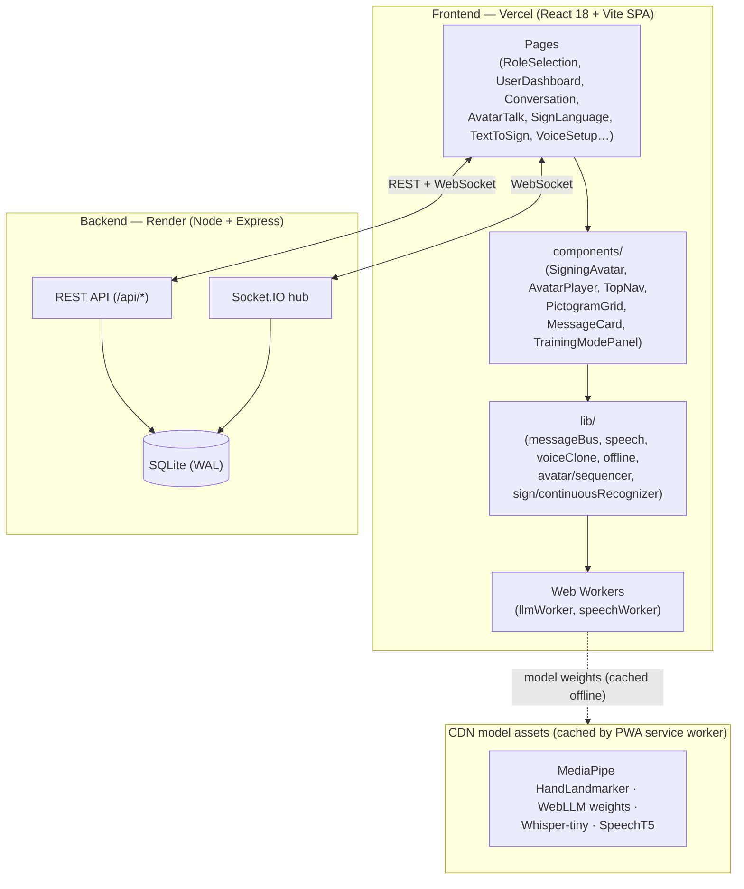

# VaakSetu Architecture

Deep-dive into how the Bridge of Voice works end to end.

## System Overview



## Frontend Component Tree (avatar path)

```
main.tsx (BrowserRouter, routes, PWA bootstrap)
├─ components/TopNav.tsx            # sticky aurora nav + command palette (⌘K)
├─ pages/AvatarConversationPage.tsx # /avatar-talk — Phase 5 interpreter
│  ├─ Hearing panel   → webkitSpeechRecognition + noise-gated transcript
│  ├─ Avatar panel    → components/Avatar/AvatarPlayer.tsx
│  │                     └─ components/Avatar/SigningAvatar.tsx (SVG rig)
│  ├─ Deaf panel      → MediaPipe HandLandmarker + lib/sign/continuousRecognizer
│  └─ Chat history    → in-memory + Socket.IO room relay
├─ pages/ConversationPage.tsx       # /conversation — pictogram ↔ voice
├─ pages/SignLanguagePage.tsx       # /sign — static + dynamic + continuous ISL
└─ pages/TextToSignPage.tsx         # /text-to-sign — avatar playback + WebM export
```

### Avatar pipeline (text → motion)

```
sentence
  → lib/avatar/sequencer.ts     (longest-phrase match → word signs → fingerspelling)
  → lib/avatar/poses.ts         (100+ parametric poses, declaration order matters!)
  → AvatarPlayer.tsx            (playback clock, captions, progress, speed)
  → SigningAvatar.tsx           (two-bone IK arms, 5-finger hands, expressions,
                                 state machine: idle | listening | signing | speaking,
                                 emotion: neutral | positive | negative)
```

### Continuous ISL pipeline (motion → text)

```
camera frames
  → MediaPipe HandLandmarker (WASM+GPU, 21 landmarks/hand, 2 hands)
  → ContinuousRecognizer (lib/sign/continuousRecognizer.ts)
      ├─ normalizeHand(): wrist-centered, palm-scaled 63-dim vector
      ├─ motion-energy segmentation (60-frame ≈ 2s rolling window)
      └─ classification: ONNX model (/models/isl-continuous.onnx) → DTW vs motion templates
  → segments → sentence chips → Send (TTS + broadcast) 
```

## Socket.IO Events Reference

Client ↔ `backend/server.js`. The backend rebuilds every payload through
`makeMessage()` and persists via SQLite; the client smuggles its typed message
shape through the `role` field (see `frontend/src/lib/messageBus.ts`).

| Event | Direction | Payload | Purpose |
|---|---|---|---|
| `message:send` | client → server | `{role, content, confidence, emergency, id, timestamp}` | Ingest a conversation message |
| `message:new` | server → all | full message row | Broadcast new message |
| `messages:history` | server → client | `messages[]` | Hydrate recent history |
| `typing` | both | `{who, typing}` | Typing indicator relay |
| `message:delivered` / `message:read` | client → server | `{id}` | Mark delivery/read receipt |
| `message:status` | server → clients | `{id, status}` | Delivery/read receipts |
| `reply:new` | server → clients | `{id, type:'reply', text, timestamp}` | Guardian reply broadcast |
| `messages:cleared` | server → all | `{userId}` | History cleared |
| `avatar-room:join` | client → server | `{room}` | Join group session room (`avatar-room:<uuid>`) |
| `avatar-room:leave` | client → server | `{room}` | Leave room |
| `avatar-room:message` | both | `{room, side:'hearing'\|'deaf', text, confidence, lang, timestamp}` | Bidirectional avatar-talk turn relay (sender renders optimistically; server relays to the rest of the room) |
| `avatar-room:members` | server → room | `{room, count}` | Participant count updates |

## REST API Reference

| Method | Path | Purpose |
|---|---|---|
| GET | `/api/health` | Liveness + message count |
| GET | `/api/messages?limit&userId` | Recent messages (optionally per user) |
| POST | `/api/messages` | Persist + broadcast a message |
| DELETE | `/api/messages?userId` | Clear a user's history |
| PATCH | `/api/messages/:id/delivered` | Mark delivered |
| POST | `/api/replies` | Persist + broadcast guardian reply |
| GET | `/api/replies/:userId` | List replies for a user |
| POST | `/api/tts/voice-clone` | XTTS-v2 clone via Replicate; `501 fallback:'local-pitch'` when unset |
| GET | `/api/admin/stats?days` | Aggregated dashboard stats |
| GET | `/api/admin/timeline?days` | Per-day message counts (gap-filled) |

## Database Schema (SQLite, WAL mode)

`backend/db.js` uses `node:sqlite` (built into Node ≥ 22.5 — no native compile).
DB file: `backend/data/vaaksetu.db`.

```sql
CREATE TABLE IF NOT EXISTS messages (
  id          TEXT PRIMARY KEY,
  timestamp   TEXT NOT NULL,      -- ISO 8601
  user_id     TEXT NOT NULL,      -- stable pseudo-id from localStorage
  role        TEXT NOT NULL,      -- 'user' | 'message' | 'reply' | 'mood' | 'sign' (type discriminator)
  content     TEXT NOT NULL,      -- message text (mood value for mood rows)
  confidence  INTEGER DEFAULT 0,
  lang        TEXT DEFAULT 'en',
  emergency   INTEGER DEFAULT 0,
  delivered   INTEGER DEFAULT 0,  -- migration-safe added column
  created_at  INTEGER NOT NULL    -- epoch ms, drives indexes/timeline
);

CREATE TABLE IF NOT EXISTS replies (
  id          TEXT PRIMARY KEY,
  message_id  TEXT,               -- optional reference to the triggering message
  user_id     TEXT NOT NULL,
  text        TEXT NOT NULL,
  guardian_id TEXT DEFAULT 'guardian',
  created_at  INTEGER NOT NULL
);

CREATE INDEX idx_messages_created       ON messages(created_at DESC);
CREATE INDEX idx_messages_user          ON messages(user_id);
CREATE INDEX idx_messages_user_created  ON messages(user_id, created_at DESC);
CREATE INDEX idx_messages_type          ON messages(role);
CREATE INDEX idx_replies_user_created   ON replies(user_id, created_at DESC);
```

**Migration pattern:** older DBs predate `messages.delivered`; `db.js` probes the
column and `ALTER TABLE`s it in when missing.

## AI Model Loading Strategy

| Model | Loader | Where it runs | Cache | Failure mode |
|---|---|---|---|---|
| MediaPipe HandLandmarker | `@mediapipe/tasks-vision` (CDN WASM) | Main thread, GPU delegate | PWA CacheFirst (30d) | `/sign` falls back to heuristic classification + demo gallery |
| WebLLM Qwen2.5-0.5B (q4f16) | `@mlc-ai/web-llm` (esm.sh, dynamic import) | Dedicated Web Worker (`llmWorker.ts`), WebGPU | IndexedDB (web-llm managed) | Layer-2 intent prediction silently disabled; rule layer stays |
| Whisper-tiny | `@xenova/transformers` (dynamic import) | Worker (`speechWorker.ts`), WASM q8 | Browser cache (HF) | Offline STT returns null; Web Speech API remains |
| SpeechT5 + x-vocoder speaker embedding | Transformers.js | Worker, WASM | Browser cache | Native TTS fallback |
| XTTS-v2 | Replicate API (server) | Cloud | — | `local-pitch` fallback (pitch-matched native TTS) |
| isl-continuous.onnx | onnxruntime-web (CDN, dynamic import) | Main thread, WASM | — | DTW against built-in motion templates |

**Design rules:**
1. **Nothing on the critical path.** Every model loads lazily behind a user
   gesture or a dedicated worker; page load never blocks on model weights.
2. **Graceful degradation everywhere.** Each loader has a fallback that keeps
   the feature at least partially usable offline.
3. **Cache-first for weights.** The Workbox runtime caches CDN model assets so
   second load + offline use cost zero network.
4. **Privacy by construction.** Hand landmarks, voice samples, and inference
   never leave the device except when the user explicitly sends a message or
   (opt-in) uses server-side voice cloning.

## Deployment Topology

- **Frontend** → Vercel (`vaaksetu.vercel.app`), SPA fallback enabled, PWA
  precache + Workbox runtime caching
- **Backend** → Render (`vaaksetu-api-cit0.onrender.com`), `render.yaml`,
  SQLite on persistent disk (`backend/data/`, gitignored)
- Client resolves the backend via `VITE_API_URL` at build time (see
  `frontend/src/lib/api.ts`); same-origin empty string in dev via the Vite proxy.
